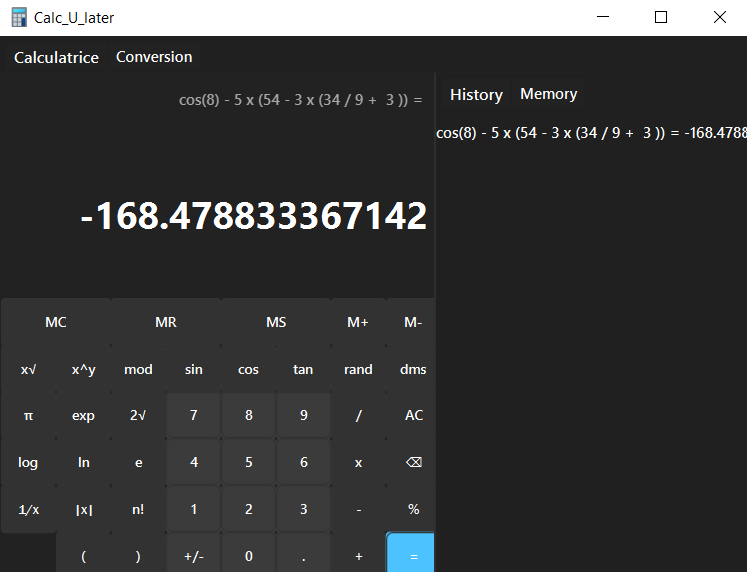
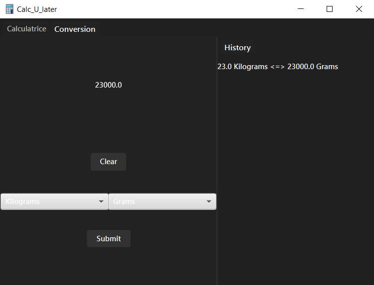

# <p align="center">**Calc U Later**</p>


### __Requirements__


- JDK 17+
<br></br>


### Installation

- git clone
```
git clone https://github.com/pelayo-joel/calc_u_later.git
```

- [JDK](https://www.oracle.com/fr/java/technologies/downloads/)

<br></br>


## <p align="center">**Presentation**</p>
---
<div align="center">
</div>

<p align="center">Re-creation of the windows calculator, has a converter and handles scientific expressions.</p>
<br></br>

### **Details**
- The structure here is pretty simple:
<br></br>

    - ``App.java`` as the main file to run.
    - ``controllers`` links the view with model.
    - ``models`` holds the calculator's logic.
<br></br>
<br></br>

- The calculator uses the Reverse Polish notation to evaluate complex expression, it runs the Shunting Yard algorithm on the base expression to get the RP expression then evaluates it. [More details here](https://brilliant.org/wiki/shunting-yard-algorithm/#:~:text=The%20shunting%20yard%20algorithm%20is,account%20the%20order%20of%20precedence.)

- Notes: 
    - [<span style="color: red">ISSUE</span>] The ``M+`` and ``M-`` buttons on the calculator do not work, but they do in the ``Memory`` tab.
    - [<span style="color: red">ISSUE</span>] Chained operations might chain with an incorrect second operand.
    - [<span style="color: red">ISSUE</span>] App does not handle very large values.

<br></br>
### **CREDITS** 

- [Aigon Elie](https://github.com/elie-aigon)
- [Pelayo Joel](https://github.com/pelayo-joel)

